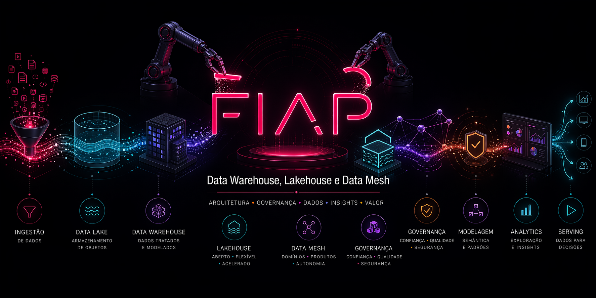

<p align="center">
  
</p>

# Data Warehouse, Lakehouse e Data Mesh

Repositório oficial dos laboratórios práticos da disciplina **Data Warehouse, Lakehouse e Data Mesh** do MBA da FIAP. Aqui você encontrará todos os exercícios guiados, scripts de apoio e instruções para evoluir da camada de storage até o consumo de tabelas em formato aberto (Open Table Format) na nuvem AWS.

---

## Visão geral

Os laboratórios foram desenhados para serem executados em um ambiente padronizado (GitHub Codespaces + AWS Academy), garantindo que todos os alunos tenham a mesma experiência, sem precisar instalar nada localmente.

Você irá percorrer um caminho que evolui da fundação do Data Lake até funcionalidades avançadas de Lakehouse com Apache Iceberg:

1. **Preparação do ambiente** — configuração do Codespaces, AWS Academy, credenciais e chave SSH.
2. **Storage** — envio de arquivos ao S3 e estratégias de upload.
3. **Open Table Format** — criação, evolução e consumo de tabelas Apache Iceberg usando o Amazon Athena.

---

## Pré-requisitos

Antes de iniciar qualquer laboratório, você precisa de:

- uma conta no [GitHub](https://github.com) (para fork do repositório e Codespaces)
- uma conta ativa no [AWS Academy](https://www.awsacademy.com/LMS_Login) com a turma `AWS Academy Learner Lab`
- acesso ao email institucional da FIAP (`rm<SEU RM>@fiap.com.br`)

> [!IMPORTANT]
> **SEMPRE DESLIGUE** o Codespaces ao final da aula para não consumir créditos desnecessariamente. Acesse [github.com/codespaces](https://github.com/codespaces), clique nos três pontinhos ao lado do ambiente e selecione `Stop Codespace`.

---

## Como usar este repositório

### 1. Faça o fork

Clique em `Fork` no canto superior direito da página do repositório no GitHub e copie-o para sua conta. Mantenha a opção `Copy the master branch only` **desmarcada** para ter acesso a todas as branches.

### 2. Crie o Codespaces

A partir do seu fork, crie um Codespace usando a configuração `FIAP Lab` na região `US East` com máquina `2-core`. O ambiente já vem com todas as dependências necessárias (AWS CLI, Python, bibliotecas e scripts de apoio).

### 3. Configure as credenciais AWS

A cada sessão do AWS Academy, copie as credenciais em `AWS Details → AWS CLI` para o arquivo `~/.aws/credentials` do Codespaces. Valide com:

```bash
aws s3 ls
```

### 4. Siga os laboratórios na ordem

Comece pelo setup e avance sequencialmente. Cada laboratório tem seu próprio `README.md` com instruções passo a passo, explicações contextuais (blocos `💡 Clique para entender`) e prints de referência.

> [!TIP]
> O passo a passo completo de configuração está em [00-create-codespaces/README.md](00-create-codespaces/README.md). Guarde esse material — você vai reutilizá-lo em toda aula ao atualizar as credenciais.

---

## Demos disponíveis

| # | Laboratório | Descrição | Link |
|---|-------------|-----------|------|
| 00 | **Setup e configuração do ambiente** | Fork do repositório, criação do Codespaces, acesso à conta AWS Academy, criação do bucket base no S3, configuração de credenciais e chave SSH. | [00-create-codespaces](00-create-codespaces/README.md) |
| 01.1 | **Storage de objetos no S3** | Envio de arquivos de diferentes tamanhos para o S3, comparação entre estratégias de upload (multipart, transfer acceleration) e análise do comportamento do S3 para arquivos grandes, médios e pequenos. | [01-Storage/01-Storage-de-Objetos](01-Storage/01-Storage-de-Objetos/README.md) |
| 02.1 | **Iceberg — Funcionalidades básicas** | Criação de tabelas Apache Iceberg no Athena, operações de `INSERT`, `UPDATE`, `DELETE`, consulta de snapshots e histórico (`FOR VERSION AS OF`, `FOR TIMESTAMP AS OF`) e evolução de esquema. | [02-Open-Table-Format/1-Funcionalidades-Basicas](02-Open-Table-Format/1-Funcionalidades-Basicas/README.md) |
| 02.2 | **Iceberg — Funcionalidades avançadas** | Particionamento oculto (hidden partitioning), uso de `MERGE INTO` para atualizações condicionais e manutenção de tabelas com `OPTIMIZE`. | [02-Open-Table-Format/2-Funcionalidades-avancadas](02-Open-Table-Format/2-Funcionalidades-avancadas/README.md) |
| 02.3 | **Iceberg — Consumindo tabelas** | Consulta de tabelas Iceberg no Athena, uso de `EXPLAIN` e `EXPLAIN ANALYZE` para análise de planos e criação de views sobre tabelas Iceberg. | [02-Open-Table-Format/3-Consumindo-tabelas](02-Open-Table-Format/3-Consumindo-tabelas/README.md) |

---

## Estrutura do repositório

```
.
├── 00-create-codespaces/            # Setup do ambiente (Codespaces, AWS Academy, credenciais)
├── 01-Storage/
│   └── 01-Storage-de-Objetos/       # Lab de storage no S3
├── 02-Open-Table-Format/
│   ├── 1-Funcionalidades-Basicas/   # Lab Iceberg básico (INSERT/UPDATE/DELETE, time travel)
│   ├── 2-Funcionalidades-avancadas/ # Lab Iceberg avançado (partitioning, MERGE, OPTIMIZE)
│   └── 3-Consumindo-tabelas/        # Lab de consumo de tabelas Iceberg
├── .devcontainer/                   # Configuração do GitHub Codespaces
└── FIAP.png
```

---

## Fluxo recomendado

```
00 Setup  ──▶  01 Storage  ──▶  02.1 Iceberg básico  ──▶  02.2 Iceberg avançado  ──▶  02.3 Consumo
```

Cada laboratório assume que os anteriores já foram concluídos. Em especial, os laboratórios de Open Table Format dependem do bucket `base-config-<SEU RM>` criado no setup inicial e do ambiente TPC-DS preparado no primeiro lab do Athena.

---

## Dicas gerais

- **Blocos `💡 Clique para entender`**: sempre que encontrar nos READMEs, abra — eles trazem o contexto técnico e a motivação pedagógica de cada comando.
- **Erro de tabela inexistente no Athena?** Verifique se o banco selecionado no painel esquerdo corresponde ao laboratório em que as tabelas foram criadas (`athena_iceberg_db`, `glue_iceberg_db`, etc.).
- **Credenciais expiradas?** Cada sessão do AWS Academy dura 4 horas. Basta iniciar uma nova sessão e recopiar as credenciais para `~/.aws/credentials`.

---

## Suporte

Caso encontre algum problema:

1. Releia atentamente o passo em que você está — os READMEs trazem os erros mais comuns sinalizados com `> [!IMPORTANT]` ou `> [!WARNING]`.
2. Valide os pré-requisitos listados no início de cada laboratório.
3. Consulte o professor ou monitores durante a aula.

### Contato

Ficou com alguma dúvida ou quer trocar uma ideia sobre os laboratórios?

- 📧 **Email:** [Rafael@rfbarbosa.com](mailto:Rafael@rfbarbosa.com)
- 💼 **LinkedIn:** [Rafael Barbosa](https://www.linkedin.com/in/rafael-barbosa-serverless/)

---

**Bons estudos!** 🎓
